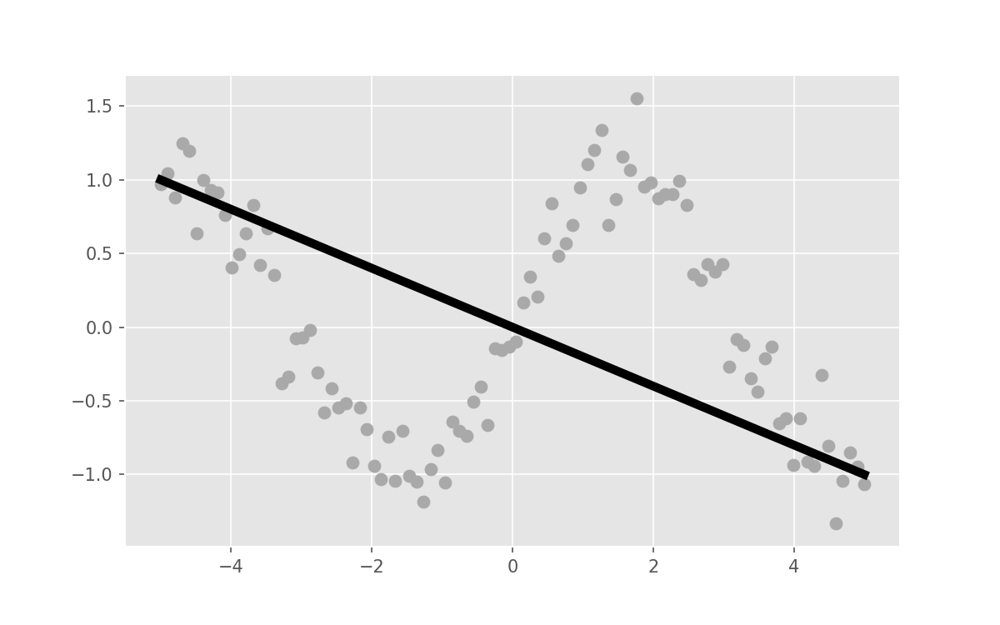

## Chapter 3

It is possible to include images. 
You can either include html directly:

```
</img>
```

which will produce the following image,

</img>

or use the Markdown syntax

```

```

which will produce the following image,


The provided CSS file ensures that both images are resized to 100% width.
If different CSS styles are used, the Markdown syntax and the direct html syntax may produce different results.
